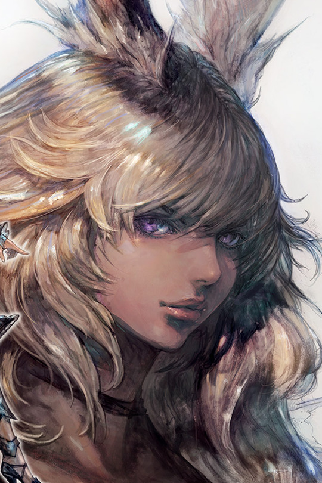

## Basic Info
*Name:* Alzena Fey *Age:* 22 *Race:* Raava Viera *Gender:* Female *Sexuality:* lesbian *Marital Status:* Single *Server:* Balmung *Starsign:* ??? *MBTI:* ENFP-A

## Bio:
Alzena is a Ravaa viera. When she came of age, Alzena left her home in the Golmore Jungle to make for Dalmasca. Unfortunately not long after she got there, she was captured and brought forcibly to Uldah where she was held captive and worked as a brothel girl for years. Eventually, Alzena's charms and skill as a dancer won her favour with the rich and elite of Eorzea. She was sent to the Golden Saucer where she danced and worked as an entertainer for the upper echelon. Alzena's alluring performances became well known across Eorzea, and eventually earned her enough reputation, favour, and gil to afford her the rare chance at buying her freedom. She now wanders Eorzea, keeping a low profile and avoiding the rich an elite who desperately wish to claim her once again as their own.

## Physical Appearance
*Hair:* Alzena has long Fluffy blonde hair. A few tufts of her bangs are colored a light whimsical pink. Despite people’s assumptions, Alzena claims the tufts are natural, and swears she never dyed them.

*Height:* VERY Tall.

*Skin color:* Light brown (Brown sugar/milk chocolate toned)

*Build:* Alzena is very curvaceous with a well endowed chest. While Alzena naturally tends towards the thick, curvy, and even slightly pudgy side, her years of captivity in the brothels of Uldah have led to her being malnourished, and a bit thinner than she should be.

## Profession: 
Alzena is a dancer and an entertainer by trade. She worked her way up to this profession during her years in captivity as a brothel girl. While the other women in the brothel would bite, spit in the faces of their clients, and attempt to flee, Alzena tried to make the best of her situation. She used her brothel work as an opportunity to hone her dancing and singing skills. Alzena would perform native Raavan dances and sing lullabies and folk tunes for her clients. She mixed traditional dance with the erotic movements and gestures she was forced to learn and perform from her brothel madam. 

After catching the eye of more than one elite customer, Alzena was sold to a more reputable escort service, and eventually worked her way up to an indentured servant working as an adult entertainer at the Golden Saucer. There her dance skills and fame took new heights, as she bolstered her own routine with moves she learned from another top performer. This mysterious woman she met claimed to be from a hidden village at the bottom of the Ruby Sea. The woman's performances were native dances that the women of her tribe would perform to lure sailors and confederates beneath the water to their deaths. They then would steal their possessions and sell them on the markets of Kugane. 

Alzena had a short heated romance with this performer that unfortunately ended with Alzena getting her heart broken. Alzena took what she learned from her ex and danced with even more fervor and passion, until the day came that her contract ended and she had earned enough money to buy her freedom.

## Personality
Alzena is very extroverted, talkative, and friendly. She’s naturally a very open hearted and touchy feely person. Jovial and quite popular, Alzena oozes with charisma and charm. On occasion, she can be short tempered, curious to a fault, overly idealistic, and naive. 

Alzena has an interest books and loves the look and feeling of them, but unfortunately she cannot read in Eorzean. During her time in captivity, books were kept away from her, and she was forbidden to learn how to read. Her brothel madam, however, took a liking to her and taught Alzena to speak fluently in Eorzean. She does, however, know how to read and write in Raavan, her native language.

While Alzena is quite popular with the opposite sex, she actually has neither romantic nor sexual interest in men. This comes partly from her upbringing in an isolated Raavan tribe, where she was exposed to so few men, and her forced captivity which led her first big impressions of men to be severely negative. Alzena naturally feels a strong infatuation towards women whom can match her own charm, charisma, and beauty. Alzena often times goes as far as confusing admiration for love and even envy. She finds herself having feelings for competing dancers and performers, which leads to her getting a broken heart and taken advantage of easily.

## Interest
Alzena has an absolute weakness for sweets. Her favorites are anything with chocolate, but there isn’t a sweet food around that she won’t eat. Alzena is a foodie, and when she can, loves eating at the different cafes and eateries around Eorzea. Her time spent in the Gold Saucer led her to develop a sophisticated and expensive taste.

Alzena loves being with people, anyone at all, whether it’s a stroll around the city or a breathtaking adventure. Even when she’s not with anyone, Alzena likes to be around people and enjoys busy areas. Despite having never been trained, Alzena also is quite musically intelligent, and has a fantastic singing voice. She hums to herself all of the time, and of course loves to let loose and dance. If she were to attempt it, Alzena would quickly learn a musical instrument

## Relationships
Alzena loves the idea of being with someone, but is fearful of commitment. Her life has afforded her few opportunities for involved romantic relationships. However, the one time she did indulge in a relationship with another female dancer, it ended with Alzena getting her heart broken. To this day she still suffers aches and pains from from her past heartbreak.

Alzena doesn’t talk much about her previous life in the Raavan tribe, and even less about her parents. If anyone ask, she smiles and talks around the question. It’s a mystery how she truly feels about her family, and the exact circumstances of why she left home.

## Possible Hooks
Perhaps you’re a well off or powerful person that’s seen one of Alzena’s live performances, or maybe you’ve heard of her shows in passing? If you’ve been to the golden saucer then she’s impossible to miss!

Are you the owner of a bar, restaurant, theater group or anything else that would require a dancer? If so, then Alzena might just catch your eye. Alzena frequently goes out to eat, and even practices her performances in public. She’s a very easy woman to spot in those situations, and simply approaching her works well enough!

Alzena is a bit of a mess, given her newly found freedom. If you’re a kind soul looking to offer her stability, a place to stay, helpful guidance, or even regular work, then your gesture will likely be met with open arms.

Lastly if you’re a woman, Alzena will open up to you a lost faster. If you’re a man, she might keep her guard up until she’s sure of your intentions.

## What I'm looking for
This is one of my first times role playing on FFXIV. I’m really just looking for a way to ease into the scene and make some great friends whom I can share great times with. I’d prefer smaller more quiet sessions. 1 on 1 dialogues at first, and encounters/ adventures with 4 people max. I’d like to not have my voice lost in a big RP crowd while I’m brand new to this.

30 minutes to 1 hour sessions at first! (2max) I’m a bit busy so scheduling them in advance would help a LOT!

While I understand that Alzena’s back story is very adult themed, I’m not looking ERP or relationship RP. Don’t get me wrong, if the situation leads to any of these things Alzena won’t necessarily refuse them, but specifically I’m not wanting my RP sessions to revolve around sex and relationships. I’d just like to avoid them as much as possible, they can invite a lot of stress and chaos.

## Player Info
I’m pretty friendly, an ambivert, and a bit of a dreamer. I can be a tad bit wordy, but can always tone it down if you need.

I try to match people’s RP style, and make sure everyone is having a good time. I hate seeing people not get a turn or get interrupted/ignored. I’m empathetic, so if I see someone hurting I naturally try to help. I can be a bit anxious, self-conscious, and moody, but do my best to work on it and keep a smile on! 

I’m also an artist and love drawing cute doughy female characters designs. I’m an indie game developer and am working on a project called “Faerie Heart”. Other facts: I’m 28, married, graduated from college with an art degree, and work a tech industry job.

